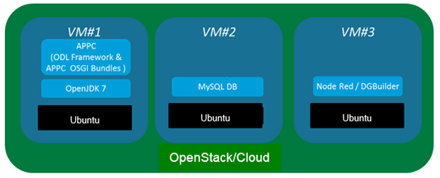
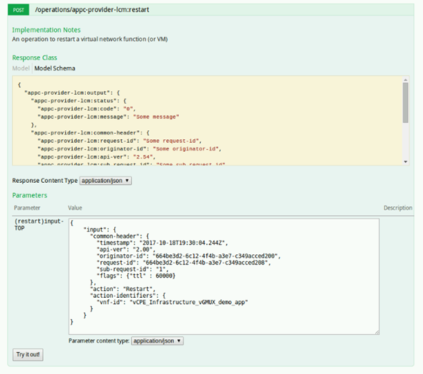
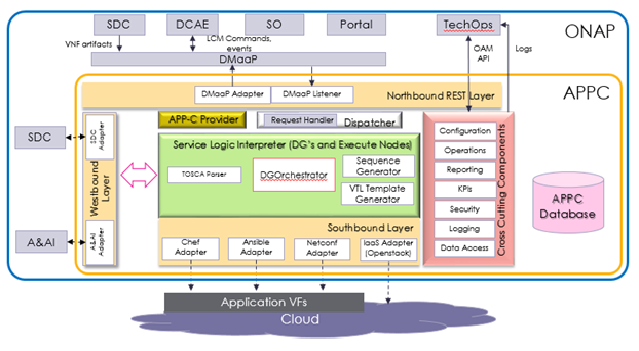

.. ============LICENSE_START==========================================
.. ===================================================================
.. Copyright © 2017 AT&T Intellectual Property. All rights reserved.
.. ===================================================================
.. Licensed under the Creative Commons License, Attribution 4.0 Intl.  (the "License");
.. you may not use this documentation except in compliance with the License.
.. You may obtain a copy of the License at
.. 
..  https://creativecommons.org/licenses/by/4.0/
.. 
.. Unless required by applicable law or agreed to in writing, software
.. distributed under the License is distributed on an "AS IS" BASIS,
.. WITHOUT WARRANTIES OR CONDITIONS OF ANY KIND, either express or implied.
.. See the License for the specific language governing permissions and
.. limitations under the License.
.. ============LICENSE_END============================================
.. ECOMP is a trademark and service mark of AT&T Intellectual Property.

===============
APPC User Guide
===============

APPC Overview and Architecture
==============================
The Application Controller (APPC) is one of the components of the ONAP
platform. It is responsible for handling the Life Cycle Management (LCM)
of Virtual Network Functions (VNFs).

This document provides an overview of the APPC components that enable
the LCM operations.

Implementation
--------------
The APPC infrastructure is implemented on virtual machines in an
OpenStack cloud in the Amsterdam release. APPC is created on top of the OpenDaylight (ODL)
platform

The following diagram represents a non-redundant APP-C deployment.

|image0|

Features
--------
The APPC HTTP API supports Life Cycle Management (LCM) commands,
allowing users to manage virtual applications and their components via
other ONAP components. Refer to Architecture section for further
details.

Interface
---------
The Application Controller Dashboard interacts with the controller
using REST APIs and performs actions on VNF/VNFC/VMs, such as snapshot,
lock, sync, and health-check.

Dashboard
~~~~~~~~~

To open the Application Controller dashboard, go to:

|image1|

Navigate to the available LCM commands by clicking on
    **appc-provider-lcm**:

|image2|

Click on the URI of the desired action to open a frame with information
about the action and an option to try it out. For example, to send the
action, add the request body as the input parameter value, and click
**Try it out!**

The following figure shows an example body of a LCM restart request:

|image3|

If the request is accepted, you should see the following response:

|image4|

APPC Architecture 
-----------------

This section discusses the APPC internal components in detail.

**APPC High Level Architecture**

|image5|

Northbound REST Layer
~~~~~~~~~~~~~~~~~~~~~

This layer is responsible for interfacing with APPC clients, such as SO
or SDC and others, exposing YANG-based API via REST HTTP and/or DMaaP
messaging (see the Interfaces Summary section for details). In addition,
it exposes APPC OAM (Operation Administration Management) APIs, enabling
ONAP Operations Manager (OOM) or TechOps portal to perform APPC
lifecycle operations

APPC Provider
~~~~~~~~~~~~~

The APPC Provider module exposes the endpoints for each action
supported by APPC. This module uses the YANG model to define the
YANG Remote Processing Call (RPC) and data model, in other words,
the input and output parameters for each action. The Provider module 
is responsible for validating the RPC input and for rejecting any
malformed input. After successful validation, the APPC Provider
calls the Dispatcher to continue the request processing.

LCM API
~~~~~~~

The APPC exposes an HTTP API to support the Life Cycle Management
(LCM) commands sent from ONAP components such as SO, SDC, and the
Portal. These commands enable the components to request APPC to
perform actions such as to control, modify, start, or stop virtual
applications and/or their components. 

A virtual application is composed of the following layers. A Life
Cycle Management command may affect any number of these layers.

-  Virtual Network Function (VNF)

-  Virtual Network Function Component (VNFC)

-  Virtual Machine (VM)

APP-C supports two types of LCM requests, as described below.

**Note:** For further information about LCM API, including details of
all the commands currently supported in APP-C and examples of the
request and response format see the ONAP Application Controller (APPC) API Guide. 

LCM over REST 
^^^^^^^^^^^^^^

LCM command requests over REST are sent to the APPC using an HTTP
POST request. APPC returns one or more responses for each LCM
request. 

The APP-C LCM API provides a POST HTTP API endpoint per command. 

An **asynchronous** command, containing an authorized and valid
request, results in at least two discrete response events:

-  an ACCEPT (a synchronous HTTP response) to indicate that the request
       is accepted and will be processed, and

-  a final asynchronous response for the command containing an execution
       status is sent via DMaaP

An unauthorized or invalid request would result in a single
ERROR response. 

For commands such as Restart, Start, and Stop, the asynchronous response
is sent over DMaaP.

A **synchronous** command, for example Lock or Unlock, results in a
single response, which is either SUCCESS or ERROR. For this type of
request, the first response is a synchronous HTTP response..

For the ONAP Amsterdam release, APPC supports the HTTPS protocol, whereas the plain
HTTP requests are blocked..

Endpoint format: 

``<http-protocol>://<appc-ip>:<appc-api-port>/restconf/operations/appc-provider-lcm:<command-name>``

LCM over Message Bus (DMaaP)
^^^^^^^^^^^^^^^^^^^^^^^^^^^^

APPC is capable of receiving LCM command requests as messages on the
DMaaP bus. In this case, APPC returns one or more responses for each LCM
request, similar to LCM over REST, while both are communicated over
DMaaP.

Configure the Read/Write topics for the DMaaP as described in APPC
Deployment, APPC Available Properties.

APPC client library, embedded into APPC client’s (for example, SO) code,
intends to simplify communication over DMaaP by eliminating topic
provisioning at the client site. Refer to
http://onap.readthedocs.io/en/latest/ for more details on the APPC
Client Library.

For further information about the request and response format, see
the APPC API Guide at http://onap.readthedocs.io/en/latest/

Dispatcher
~~~~~~~~~~

The APPC Dispatcher component processes requests received by the Request
Handler from other ECOMP components. The Dispatcher checks the
conditions are sufficient for performing the request and selects the
correct Direct Graph (DG) workflow for execution or rejects the request.
When the DG execution is complete, the Dispatching function is
responsible for notifying the initiator of the operation with the
request execution result (Success/Error) and updates the VNF
Orchestration state in Active and Available Inventory (A&AI).

The detailed responsibilities of the Dispatcher are as follows:

-  Upon receiving the operation request, the Dispatcher performs the
   synchronous part of the execution:

   -  Starts the operation's time-to-live countdown

   -  Queries A&AI to get the VNF type and its current orchestration
      state

   -  Checks VNF\_type-specific rules in the LCM State machine for
      whether to allow or reject the requested command execution

   -  Allocates and initiates an appropriate DG workflow by invoking the
      Service Logic Interpreter (SLI) framework to start the
      asynchronous part of the execution

   -  Returns a response to the initiator: OK or reject (for example, if
      the State Machine blocks the operation, no DG or time-to-live, or
      bad parameters)

   -  If the operation is rejected, the Dispatcher generates an
      appropriate Audit log for the Event and Error Logging Framework
      (EELF) and the Local Event Journal

-  Upon workflow completion, the Dispatcher:

   -  Receives the execution results from the DG from the SLI framework

   -  Publishes the execution result over DMaaP (success or error)

   -  Updates VNF status in A&AI

   -  Generates an Audit log for EELF and Local Event Journal

Request Handler
^^^^^^^^^^^^^^^

The Request Handler manages incoming requests and locks APPC for new
requests, as needed for operations with a specific command execution
sequences.

Lifecycle Management
^^^^^^^^^^^^^^^^^^^^

The Lifecycle Management VNF State Machine enables the Dispatching
function to determine the validity of the requested operation (desired
state) as a function of the current VNF state, acquired from the A&AI.
The State Machine maintains its data (states and valid operations)
in-memory. At the point of APPC initialization, the State Machine
constructs a matrix based on the metadata of the current operation and
the valid desired state. 

Command Executor
^^^^^^^^^^^^^^^^

Manages command execution queue.

State Machine
~~~~~~~~~~~~~

The VNF State machine enables the Dispatching function to determine
the validity of the requested operation (desired state) as a
function of the current VNF state, acquired from the A&AI. The State
machine maintains its data (states and valid operations) in-memory.
At the point of APP-C initialization, the State Machine constructs a
matrix based on the metadata of the current operation and the valid
desired state. 

The Service Logic Interpreter (SLI) Framework
~~~~~~~~~~~~~~~~~~~~~~~~~~~~~~~~~~~~~~~~~~~~~

The SLI framework is responsible for executing Directed Graphs (DGs).
The Dispatcher invokes the SLI framework to execute a specific DG, based
on the input action. The SLI executes the DG and the sub-DG and returns
a success or failure response to the caller along with the context
variables used to exchange data with the calling body (for example, the
Dispatcher). The caller can use the SLI context to specify data required
for DG execution. The DG returns the same context when execution
completes.

Currently, there is a combination of input action specific and/or VNF
type specific DG’s as well as a DGOrchestrator DG which is action and
VNF type agnostic. The DGOrchestrator approach consists of the
following:

-  DGOrchestrator DG which:

   -  Accepts request from the Dispatcher and converts it into DG
      context format

   -  Calls A&AI to retrieve the inventory for the VNF instance

   -  Calls a Sequence Generator for start/stop actions which generates
      a workflow sequence containing a set of start or stop VM requests

   -  Auto-generates a workflow for other requests with a single step

   -  Executes each step in the workflow by invoking DG’s to interact
      with the VNF, OpenStack, or Ansible/Chef servers. These DG’s which
      are specific to the protocol and possibly action. Some DG’s may
      update A&AI (such as for Configure) or retrieve the VNF running
      configuration.

   -  Returns success/failure status to the Dispatcher.

In the future, all action/VNF type specific DG’s will be migrated to the
DGOrchestrator approach.

The following diagram shows the Amsterdam Release DGOrchestrator
architecture

    |image6|

Westbound Layer
~~~~~~~~~~~~~~~

A&AI
^^^^

    A&AI is an ONAP component, which maintains information about VNF
    instances. APPC uses A&AI as a source of the true VNF status,
    topology and operational data. In addition, at the end of each
    operation, APPC updates the VNF changes that result from the
    operation: for example, VNFC record(s) are added after
    configuration. The VNF orchestration status is not updated for
    read-only operations such as Sync or Audit. In the case of the VNF
    Terminate operation, APPC removes the terminated VNF from A&AI by
    deleting its Virtual Machines (VMs). 

    The Dispatching function and operation-specific DGs manage access to
    the A&AI using the A&AI Adapter.  

Southbound Layer
~~~~~~~~~~~~~~~~

Southbound VNF Adapters
^^^^^^^^^^^^^^^^^^^^^^^

    APPC uses several adapters to communicate with VNFs. The Interface
    as a Service (IAAS) adapter is part of the OpenDayLight (ODL)
    platform, while other adapters have been added by the ONAP
    development.

Restconf Adapter
^^^^^^^^^^^^^^^^^

    The Adapter is responsible for configuration tasks, using JSON
    format, for VNFs supporting Restconf API.
    
**Using the Restconf Adapter**
     The restconf adapter is normally called from a directed graph.
     An "execute" node block should be used in the directed graph to
     the "org.onap.appc.adapter.rest.RestAdapter" plugin. There are
     several methods available to use:

- commonGet
- commonDelete
- commonPost
- commonPut
     
There are several parameters that the RestAdapter plugin takes

org.onap.appc.instance.URI
  The url that the rest request will be made to
org.onap.appc.instance.requestBody
  The body of the rest request
org.onap.appc.instance.headers
  The header of the rest request
org.onap.appc.instance.haveHeader
  true/false value which specifies if a header is present.
  (Should be set to "true" if the org.onap.appc.instance.headers
  parameter is defined, or set to "false" if the
  headers parameter is not defined)
  
An example execute node:

::

<execute plugin='org.onap.appc.adapter.rest.RestAdapter' method='commonPut' >
<parameter name='org.onap.appc.instance.URI' value='`$restUrl`'/>
<parameter name='org.onap.appc.instance.requestBody' value='`$jsonContent`'/>
<parameter name='org.onap.appc.instance.headers' value='{"Content-type":"application/json"}'/>
<parameter name='org.onap.appc.instance.haveHeader' value='true'/>
    
    

Netconf Adapter
^^^^^^^^^^^^^^^

    The Adapter is responsible for configuration tasks, using XML
    format, for VNFs supporting Netconf API.

IAAS Adapter 
^^^^^^^^^^^^^

    The IAAS Adapter connects APPC with the OpenStack controllers to
    perform various operations on VMs and VNFs such as Restart, Migrate,
    and Rebuild. The IAAS Adapter integrates as a DG plugin, while the
    DGs call the services exposed by the adapter.

SSH (XML/CLI) Adapter
^^^^^^^^^^^^^^^^^^^^^

    A custom adapter that enables connection to a VNF using an SSH
    session. It is designed to support CLI and XML protocols, including
    Netconf. It is used to load configurations and retrieve the running
    configuration.

Chef Adaptor
^^^^^^^^^^^^

    This adaptor incorporates a client for an external Chef server,
    which connects to VNF NB APIs. The adaptor enables APPC to operate
    cookbooks (Chef recipes) to perform various LCM operations over
    VNFs, connected to the Chef server.

Ansible Adapter
^^^^^^^^^^^^^^^

    This adaptor incorporates a client for an external Ansible server,
    which connects to VNF NB APIs. The adaptor enables APPC to operate
    playbooks to perform various LCM operations over VNFs connected to
    the Ansible server.

Cross Cutting Components
~~~~~~~~~~~~~~~~~~~~~~~~

The Cross Cutting Component services operate across all APPC modules.

Configuration
^^^^^^^^^^^^^

Used to configure operational parameters of APPC modules based on
function-specific configuration files, for example:

-  ``log4j.properties`` for the logging service

-  ``appc.properties`` for core APPC-related configuration

-  ``dblib.properties`` for managing APPC database-related configuration

-  ``aaiclient.properties`` for managing A&AI-related configuration

KPI Service
^^^^^^^^^^^

This Cross Cutting component manages KPI measurement, storage and
reporting.

Enable matrix logs to log the number of hits of the configured method of
APPC, by configuring the following properties in ``appc.properties:``::

   metric.enabled=<true>
   schedule.policy.metric.start.time=<time value in hhmmss>
   schedule.policy.metric.period = 60(interval in seconds)

Security Service
^^^^^^^^^^^^^^^^

This component implements AAF (Authentication and Authorization
Framework) for APPC API security. The user provides a user name and
password in the request that will be validated against centralize AAF.
[Note: For Amsterdam Releasse, AAF is not used]

Logging Service
^^^^^^^^^^^^^^^

Implements EELF (Event and Error Logging Framework) to manage and
generate logs (refer to Logging section).

Data Access Service
^^^^^^^^^^^^^^^^^^^

Provides access to the internal data store.

Transactions store
~~~~~~~~~~~~~~~~~~

For each operation request procedure that completes or terminates,
APPC generates and stores an accurate transaction record in its
internal database, including:

-  Timestamp

-  Request ID

-  Start time

-  End time

-  VF\_ID

-  VF\_type

-  Sub-component (optional) e.g. VFC\_ID/VM UUID

-  Operation: for example Start, Configure, etc.

-  Result: Success/Error code and description, as published to the
   initiator

Interfaces Summary
~~~~~~~~~~~~~~~~~~

+-------------------+------------+-------------------------+-------------------+-------------+----------------------------------------------------------------------------------------------------------------------------------------------------------------------------+
| **Source**        | **Flow**   | **Destination**         | **Service**       | **Port**    | **Purpose / Comments**                                                                                                                                                     |
+===================+============+=========================+===================+=============+============================================================================================================================================================================+
| APPC              |    ->      | A&AI                    | REST              | 8443        | APPC retrieves and updates the VNF data in AAI.                                                                                                                            |
+-------------------+------------+-------------------------+-------------------+-------------+----------------------------------------------------------------------------------------------------------------------------------------------------------------------------+
| APPC              |    ->      | SLI                     | Java (internal)   | N/A         | APPC sends the LCM API request to SLI for DG execution                                                                                                                     |
+-------------------+------------+-------------------------+-------------------+-------------+----------------------------------------------------------------------------------------------------------------------------------------------------------------------------+
| APPC              |    ->      | South-bound Adapters    | Java (internal)   | N/A         | APPC interacts  with southbound adapters for VNF Lifecycle Management Actions                                                                                              |
+-------------------+------------+-------------------------+-------------------+-------------+----------------------------------------------------------------------------------------------------------------------------------------------------------------------------+
| APPC              |    ->      | NETCONF                 | NETCONF           | 830 or 22   | NETCONF Adapter communicates on port 830 (default) or port 22 (SSH – if set up)                                                                                            |
+-------------------+------------+-------------------------+-------------------+-------------+----------------------------------------------------------------------------------------------------------------------------------------------------------------------------+
| APPC              |    ->      | Chef Server             | HTTP/HTTPS        | 80/443      | Chef adapter communicate on port 80 (HTTP) or port 443 (HTTPS)                                                                                                             |
+-------------------+------------+-------------------------+-------------------+-------------+----------------------------------------------------------------------------------------------------------------------------------------------------------------------------+
| APPC              |    ->      | Ansible Server          | HTTP              | 8000        | Port 8000 is used for communication between the APPC Ansible Adaptor and the Ansible Server.                                                                               |
+-------------------+------------+-------------------------+-------------------+-------------+----------------------------------------------------------------------------------------------------------------------------------------------------------------------------+
| APPC              |    ->      | MySQL                   | Java (internal)   | 3306        |                                                                                                                                                                            |
+-------------------+------------+-------------------------+-------------------+-------------+----------------------------------------------------------------------------------------------------------------------------------------------------------------------------+
| APPC              |    ->      | DG Builder              | Java (internal)   | 3000        |                                                                                                                                                                            |
+-------------------+------------+-------------------------+-------------------+-------------+----------------------------------------------------------------------------------------------------------------------------------------------------------------------------+
| APPC              |    ->      | MD-SAL, Apidoc, Karaf   | Java (internal)   | 8282        |                                                                                                                                                                            |
+-------------------+------------+-------------------------+-------------------+-------------+----------------------------------------------------------------------------------------------------------------------------------------------------------------------------+
| APPC              |    ->      | DMaaP                   | JMS               | 3904        | APPC sends the Asynchronous responses and Failure events to DMaaP Message Bus                                                                                              |
+-------------------+------------+-------------------------+-------------------+-------------+----------------------------------------------------------------------------------------------------------------------------------------------------------------------------+
| Portal,SO, DCAE   |    ->      | APPC                    | REST/DMaaP        | 3904        | APPC receives LCM commands from and makes updates to ONAP components such as the Portal, MSO, and DCAE                                                                     |
+-------------------+------------+-------------------------+-------------------+-------------+----------------------------------------------------------------------------------------------------------------------------------------------------------------------------+
| SDC               |    ->      | APPC                    | DMaaP             | 3904        | APPC requests and receives notifications from SDC for VNF License Artifacts and TOSCA dependency models.                                                                   |
+-------------------+------------+-------------------------+-------------------+-------------+----------------------------------------------------------------------------------------------------------------------------------------------------------------------------+
| APPC              |    ->      | DCAE                    | DMaaP             | 3904        | APPC sends intermediate messages to DCAE. Long-running operations such as Start, Restart, Stop, and Terminate generate intermediate success/failure messages per VNFC.     |
+-------------------+------------+-------------------------+-------------------+-------------+----------------------------------------------------------------------------------------------------------------------------------------------------------------------------+
| OOM               |    ->      | APPC                    | DMaaP             | 3904        | APPC receives operational commands: Start, Graceful Stop.                                                                                                                  |
|                   |            |                         |                   |             | APPC reports: status, KPIs.                                                                                                                                                |
+-------------------+------------+-------------------------+-------------------+-------------+----------------------------------------------------------------------------------------------------------------------------------------------------------------------------+

APPC Deployment 
================

Refer to the APPC Deployment documentation at
http://onap.readthedocs.io/en/latest/submodules/appc/deployment.git/docs/index.html

Application Controller VNF Onboarding
=====================================

LCM Command Execution Overview
------------------------------

The Application Controller assumes that the A&AI instance it is
configured with contains all the information it needs about
VNF/VNFC/VMs, otherwise any request by the user to perform an action
on a VNF will fail. The Application Controller uses a variety of SQL
tables in order to perform actions on a VNF, all of which are
described in Creation of DGs

DGs are created using the Direct Graph Builder - Node Red graphical
utility for DGs creation. DGs are then stored as XML files and loaded to
APPC MySQL database. The DGs invoke the execution of Java code from
different nodes.

DGs are resolved according to LCM Action, API version, VNF Type, and VNF
Version.

The SLI framework is responsible for executing the DGs.

Data Setup. 
~~~~~~~~~~~~

Initially, Application Controller should have a set of DGs designed
for the specific VNF type. These DGs are stored in the SVC\_LOGIC
table.

After a user sends an action request to the controller, the
Application Controller uses the VNF\_DG\_MAPPING table to map the
requested action to a specific DG. If the mapping was successful,
the input body is validated and the user receives a synchronous
response containing an Accept or a Reject message to indicate
whether the request was rejected or whether it was accepted and the
controller initiated the DG flow.

During the execution of a DG, the controller may use one or more SQL
tables to fetch or store data. For example, in order to perform a
ConfigModify action, the controller needs to fetch a username and
password to connect to the VNF and change its configuration.

ALL tables used during DG execution are described below.

Request execution
-----------------

Following initial request validation, APPC queries the A&AI inventory to
acquire all the required information regarding topology of VNF/VNFC/VMs,
operational status and operational data of the requested VNF instance. A
missing target VF instance or any missing mandatory parameter in A&AI
generate a rejection.

After acquiring the VNF type from A&AI, APPC uses the VNF\_DG\_MAPPING
table to map the requested action to a specific DG. No such DG located
in the table generates a Reject response to the user.

The Dispatcher state machine applies operation policies. A policy
allowing execution generates an Accept response to the user. Not
allowing execution generates a Reject response.

If the first two steps were successful, the controller initiates the
appropriate DG.

During the execution of a DG, the controller may use one or more SQL
tables to fetch or store data. For example, to perform a ConfigModify
action, the controller needs to fetch a username and password to connect
to the VNF and change its configuration.

`Data Setup <#_Data_Setup>`__ describes the tables used during DG
execution.

If APPC is forced stopped while it is executing an LCM request, it might
take some time to terminate all the threads that are being executed. In
addition, the old threads might start to execute again once the APPC is
restarted. The time when these treads start to execute again even after
an APPC restart is dependent on the LCM request executed by the threads
in the LCM queue and the ThreadPool size. To avoid this, it is
recommended that:

-  Start APPC only after a while to ensure that the interrupted threads
   are not executed again.

-  Do not execute the OAM-Forceful Stop command if the system is
   executing an LCM request. Let the system operate in Maintenance mode.

   1. .. rubric:: Creation of DGs
         :name: creation-of-dgs

DGs are created using the Direct Graph Builder - Node Red graphical
utility for DGs creation. DGs are then stored as XML files and loaded to
APPC MySQL database. The DGs invoke the execution of Java code from
different nodes.

At runtime, DGs are resolved according to LCM Action, API version, VNF
Type, and VNF Version.

The SLI framework is responsible for executing the DGs.

Data Setup
----------

APPC uses MySQL database as a persistent store. This section describes
the tables in general and the tables that require data to be set up
before sending a request.

SVC\_LOGIC Table
~~~~~~~~~~~~~~~~

SVC\_LOGIC table stores all NodeRed DGs invoked by actions executed by
APPC. The SLI framework uses this table for running the DG. If the DG
does not exist in this table, the SLI framework returns a 'DG not found'
error.

SVC\_LOGIC Parameters
^^^^^^^^^^^^^^^^^^^^^

+----------------------+----------------------+
| **Parameter Name**   | **Example Values**   |
+======================+======================+
| **module**           | APPC                 |
+----------------------+----------------------+
| **rpc**              | Generic\_Audit       |
+----------------------+----------------------+
| **version**          | 2.0.0                |
+----------------------+----------------------+
| **mode**             | sync                 |
+----------------------+----------------------+
| **active**           | N                    |
+----------------------+----------------------+
| **graph**            | <BLOB>               |
+----------------------+----------------------+

**module, rpc, version**

The ``module``, ``rpc``, and ``version`` parameters uniquely identify a Directed
Graph (DG). The SLI framework uses these three parameters to invoke a DG
or sub-DG. By convention, for the main DG, rpc is a combination of 'VNF
type' (the generic type applied to all VNFs) followed by '\_' and
'action'. This is the default convention; resolution of the DG for
specific actions is handled individually in the relevant forthcoming
sections.

**mode**

The DG execution node. This value is set to ‘sync’ for all APPC DGs.

**active**

This flag is the value of either 'Y' or 'N'. This flag is only used if
specific version of DG is not mentioned while calling DG. If version of
DG is not mentioned SLI framework will look for DG with active Flag set
to 'Y' and execute it if found.

**graph**

This is actual graph invoked by SLI framework. The data type is SQL
BLOB.

VNF\_DG\_MAPPING
~~~~~~~~~~~~~~~~

The VNF\_DG\_MAPPING table stores the VNF and its corresponding DG. This
is used by the DG resolver logic of the Dispatcher to map the DG to the
requested action. Only the mapping is stored; the actual DG is stored in
the SVC\_LOGIC table.

The DG resolver logic uses a combination of action, api\_version and
vnf\_type to retrieve the DG details: dg\_name (rpc column of SVC\_LOGIC
table), dg\_version and dg\_module.

The module, rpc and version uniquely identify the DG.

The following assigned priority resolves the VNF DG:

1. ``action``

2. ``api_version``

3. ``vnf_type``

4. ``vnf_version``

Blank, null or ‘\*’ values in ``api_version``, ``vnf_type`` and ``vnf_version``
are matched with any values by the DG resolver. For example, a generic
DG which can be invoked on any type of VNF ``vnf_type`` can be blank /
null or \*. The DG resolver logic first tries to match a specific DG,
and if this is not found, then look for a generic match using ‘\*’. For
example as illustrated in the Example values in below table, an entry
for the Test action and vnf\_type VSBG is specific, so it is only used
for VNFs of type VSBG, whereas for the Sync action the same DG is used
for any type of VNF and any version.

VNF\_DG\_MAPPING Parameters
^^^^^^^^^^^^^^^^^^^^^^^^^^^

+----------------------+----------------------+-----------------+
| **Parameter Name**   | **Example Values**                     |
+======================+======================+=================+
| **action**           | Test                 | Sync            |
+----------------------+----------------------+-----------------+
| **api\_verson**      | 2                    |                 |
+----------------------+----------------------+-----------------+
| **vnf\_type**        | vSBG                 |                 |
+----------------------+----------------------+-----------------+
| **vnf\_version**     |                      |                 |
+----------------------+----------------------+-----------------+
| **dg\_name**         | vSBG\_Test           | Generic\_Sync   |
+----------------------+----------------------+-----------------+
| **dg\_version**      | 2.0.0.1              | 2.0.0           |
+----------------------+----------------------+-----------------+
| **dg\_module**       | APPC                 | APPC            |
+----------------------+----------------------+-----------------+

VNFC\_DG\_MAPPING
~~~~~~~~~~~~~~~~~

VNFC\_DG\_MAPPING stores the VNFC and its corresponding DG. The DG
resolver logic of the Dispatcher uses this to map the DG to the
requested action. Only the mapping is stored; the actual DG is stored in
the SVC\_LOGIC table.

The DG resolver logic uses a combination of ``action``, ``api_version``,
``vnf_type``, and ``vnfc_type`` to retrieve the DG details: ``dg_name`` (rpc
column of SVC\_LOGIC table), ``dg_version``, and ``dg_module``.

The module, rpc and version uniquely identify the DG.

The following assigned priority resolves the VNF DG:

1. ``action``

2. ``api_version``

3. ``vnf_type``

4. ``vnfc_type``

The DG resolver matches blank, null or ‘\*’ values in ``api_version`` ,
``vnf_type`` and ``vnfc_type`` with any values. For example, a generic DG
which can be invoked on any type of VNFC 'vnfc\_type' can be blank /
null or \*. The DG resolver logic first tries to match a specific DG. If
this is not found, the DG resolver looks for a generic match using ‘\*’.

VNFC\_DG\_MAPPING parameters
^^^^^^^^^^^^^^^^^^^^^^^^^^^^

+----------------------+---------------------+
| **Parameter Name**   | **Example Value**   |
+======================+=====================+
| **action**           |                     |
+----------------------+---------------------+
| **api\_version**     |                     |
+----------------------+---------------------+
| **vnf\_type**        |                     |
+----------------------+---------------------+
| **vnfc\_type**       |                     |
+----------------------+---------------------+
| **dg\_name**         |                     |
+----------------------+---------------------+
| **dg\_version**      |                     |
+----------------------+---------------------+
| **dg\_module**       |                     |
+----------------------+---------------------+

DEVICE\_AUTHENTICATION
~~~~~~~~~~~~~~~~~~~~~~

The DEVICE\_AUTHENTICATION table stores device authentication
details. It is used by actions such as Audit and Sync which connect
with VNFs. This table stores a record that corresponds to each VNF
type, so ``vnf_type`` is unique.

Username, password and port\_number are fields corresponding to
``vnf_type``.

DEVICE\_AUTHENTICATION Parameters
^^^^^^^^^^^^^^^^^^^^^^^^^^^^^^^^^

+----------------------------------+---------------------+
| **Parameter Name**               | **Example Value**   |
+==================================+=====================+
| **device\_authentication\_id**   | 41                  |
+----------------------------------+---------------------+
| **vnf\_type**                    | vDBE-V              |
+----------------------------------+---------------------+
| **user\_name**                   | root                |
+----------------------------------+---------------------+
| **password**                     | <password>          |
+----------------------------------+---------------------+
| **port\_number**                 | 22                  |
+----------------------------------+---------------------+

VNF\_LOCK\_MANAGEMENT
~~~~~~~~~~~~~~~~~~~~~

The VNF\_LOCK\_MANAGEMENT table is used to persist data for vnf
locking. APPC locks the vnf id when actions start executing on that
vnf id. This table stores vnf\_id i.e. resource\_id  along with
owner , expiration\_time or timeout. Before execution of request,
the dispatcher checks if VNF\_ID is already locked by another action
in execution. If VNF\_ID is not locked, the dispatcher will locks it
or else returns a VNF locked error to caller.

VNF\_LOCK\_MANAGEMENT Parameters
^^^^^^^^^^^^^^^^^^^^^^^^^^^^^^^^

+----------------------+---------------------+
| **Parameter Name**   | **Example Value**   |
+======================+=====================+
| **resource\_id**     | AUDIT\_1652         |
+----------------------+---------------------+
| **owner\_id**        | vDBE-V              |
+----------------------+---------------------+
| **updated**          | 1474457140000       |
+----------------------+---------------------+
| **timeout**          | 0                   |
+----------------------+---------------------+
| **ver**              | 22                  |
+----------------------+---------------------+

This table do not require any initial setup.

VNF\_STATE\_MANAGEMENT
~~~~~~~~~~~~~~~~~~~~~~

The VNF\_STATE\_MANAGEMENT table is used to store the operational state
of VNF\_ID, whether it is stable or unstable. It stores state, owner and
updated time (in milliseconds). This table does not require any initial
setup.

VNF\_STATE\_MANAGEMENT Parameters
^^^^^^^^^^^^^^^^^^^^^^^^^^^^^^^^^

+----------------------+-------------------------------------+
| **Parameter Name**   | **Example Value**                   |
+======================+=====================================+
| **vnf\_if**          | ASHISH\_VSBG\_VNFS\_1787            |
+----------------------+-------------------------------------+
| **state**            | STABLE                              |
+----------------------+-------------------------------------+
| **owner\_id**        | ORIG\_1787@REQ\_1787@SUBREQ\_1787   |
+----------------------+-------------------------------------+
| **updated**          | 1474457140000                       |
+----------------------+-------------------------------------+
| **timeout**          | 0                                   |
+----------------------+-------------------------------------+
| **ver**              | 22                                  |
+----------------------+-------------------------------------+

UPLOAD\_CONFIG
~~~~~~~~~~~~~~

The UPLOAD\_CONFIG table is used by configuration management actions
such as Audit, Sync, ConfigModify, Terminate, and similar. It stores
device configuration: one row or record corresponds to one VNFC, so
therefore a VNF that has multiple VNFCs has multiple rows in the
table.

The UPLOAD\_CONFIG table stores configuration as the following
types:

-  ``Current``

-  ``Running``

-  ``Historic``

The ``config_indicator`` column denotes the type of configuration,
where a null value denotes ``Historic`` configuration. For a single VNFC
there should only be one ``Current`` and one ``Running`` configuration , but
there can be multiple Historic configurations. This table does not
require any initial setup.

UPLOAD\_CONFIG Parameters
^^^^^^^^^^^^^^^^^^^^^^^^^

+----------------------------+-------------------------+-------------------------+
| **Parameter Name**         | **Example Values**                                |
+============================+=========================+=========================+
| **upload\_config\_id**     | 63                      | 67                      |
+----------------------------+-------------------------+-------------------------+
| **request\_id**            | 3                       | REQ\_1690               |
+----------------------------+-------------------------+-------------------------+
| **originator\_id**         | 12345                   | ORIG\_1690              |
+----------------------------+-------------------------+-------------------------+
| **service\_description**   | abcde                   | abcde                   |
+----------------------------+-------------------------+-------------------------+
| **action**                 | ConfigModify            | Sync                    |
+----------------------------+-------------------------+-------------------------+
| **upload\_date**           | 2016-08-01 14:30:40     | 2016-09-22 12:30:40     |
+----------------------------+-------------------------+-------------------------+
| **vnf\_id**                | AUDIT\_1767             | AUDIT\_1690             |
+----------------------------+-------------------------+-------------------------+
| **vnf\_name**              | GET\_RUN\_CONFIG\_VNF   | GET\_RUN\_CONFIG\_VNF   |
+----------------------------+-------------------------+-------------------------+
| **vm\_name**               | GET\_RUN\_CONFIG\_VNF   | GET\_RUN\_CONFIG\_VNF   |
+----------------------------+-------------------------+-------------------------+
| **vnf\_type**              | vDBE-V                  | vDBE-V                  |
+----------------------------+-------------------------+-------------------------+
| **vnfc\_type**             | vDBE-V2                 | vDBE-V1                 |
+----------------------------+-------------------------+-------------------------+
| **host\_ip\_address**      | 135.25.69.37            |                         |
+----------------------------+-------------------------+-------------------------+
| **config\_indicator**      | Current                 | Running                 |
+----------------------------+-------------------------+-------------------------+
| **pending\_delete**        |                         |                         |
+----------------------------+-------------------------+-------------------------+
| **content**                | Dummy\_current          | <Configuration>         |
+----------------------------+-------------------------+-------------------------+

DEVICE\_INTERFACE\_PROTOCOL
~~~~~~~~~~~~~~~~~~~~~~~~~~~

The DEVICE\_INTERFACE\_PROTOCOL table stores the VNF type and
corresponding sub-DG used to get the running configuration of a device.
The 'getRunningConfig' DG, which is a sub-DG called by Audit and Sync
DG, uses this table. It stores the VNF type and corresponding sub-DG,
which are used to get the running configuration of a device. The ``module``
and ``DG_RPC`` are used to identify the DG from the SVC\_LOGIC table. The
``protocol`` is used to store the protocol defined for retrieving
configuration. If a mapping between the VNF type and the DG does not
exist in this table, then actions such as Audit and Sync fail with the
error message 'Device Interfacing DG not available'.

DEVICE\_INTERFACE\_PROTOCOL Parameters
^^^^^^^^^^^^^^^^^^^^^^^^^^^^^^^^^^^^^^

+---------------------------------------+--------------------------+
| **Parameter Name**                    | **Example Value**        |
+=======================================+==========================+
| **device\_interface\_protocol\_id**   | 4                        |
+---------------------------------------+--------------------------+
| **vnf\_type**                         | vDBE-V                   |
+---------------------------------------+--------------------------+
| **protocol**                          | NETCONF-XML              |
+---------------------------------------+--------------------------+
| **module**                            | APPC                     |
+---------------------------------------+--------------------------+
| **dg\_rpc**                           | getDeviceRunningConfig   |
+---------------------------------------+--------------------------+

CONFIG FILES
~~~~~~~~~~~~

The CONFIG\_FILES table is used by the several configuration DGs, using
a legacy configuration API, to store artifacts from SDC, configuration
data from requests, and configurations to be downloaded to VNFs.

CONFIG\_FILES Parameters
^^^^^^^^^^^^^^^^^^^^^^^^

+-----------------------------+----------------------------+
| **Parameter Name**          | **Example Value**          |
+=============================+============================+
| **config\_file\_id**        | 24                         |
+-----------------------------+----------------------------+
| **external\_version**       |                            |
+-----------------------------+----------------------------+
| **data\_source**            | Configurator               |
+-----------------------------+----------------------------+
| **creation\_date**          | 6/9/2016 11:16:57 AM       |
+-----------------------------+----------------------------+
| **service\_instance\_id**   | ibcx0001vm001              |
+-----------------------------+----------------------------+
| **vnf\_type**               | ISBC                       |
+-----------------------------+----------------------------+
| **vnfc\_type**              | vISBC - mmc                |
+-----------------------------+----------------------------+
| **file\_category**          | device\_configuration      |
+-----------------------------+----------------------------+
| **file\_name**              | orch\_config.json          |
+-----------------------------+----------------------------+
| **file\_content**           | (contains configuration)   |
+-----------------------------+----------------------------+

GET\_CONFIG\_TEMPLATE
~~~~~~~~~~~~~~~~~~~~~

The GET\_CONFIG\_TEMPLATE table is used by the 'getDeviceRunningConfig'
DG, which is used as a sub-DG for the Audit and Sync actions. It stores
template data corresponding to the VNF type. Template data is only used
when the protocol in DEVICE\_INTERFACING\_PROTOCOL table is set to
'CLI'. Other protocols do not use this table. If Data does not exist in
this table and protocol is set to 'CLI' then DG results in 'Error
getting Template Data'.

GET\_CONFIG\_TEMPLATE Parameters
^^^^^^^^^^^^^^^^^^^^^^^^^^^^^^^^

+---------------------------------------+-----------------------------------------+
| **Parameter Name**                    | **Example Value**                       |
+=======================================+=========================================+
| **get\_config\_template\_id**         | 1                                       |
+---------------------------------------+-----------------------------------------+
| **vnf\_type**                         | Generic                                 |
+---------------------------------------+-----------------------------------------+
| **device\_interface\_protocol\_id**   | 3                                       |
+---------------------------------------+-----------------------------------------+
| **xml\_processing**                   |                                         |
+---------------------------------------+-----------------------------------------+
| **xml\_protocol**                     |                                         |
+---------------------------------------+-----------------------------------------+
| **template**                          | Login\_Prompt: Matches "Login as:"...   |
+---------------------------------------+-----------------------------------------+

ASDC\_ARTIFACTS
~~~~~~~~~~~~~~~

The ASDC\_ARTIFACTS table contains the model received from the SDC in
YAML format. APP-C reads this model and identifies the order of the
VNFCs and their resilience types.

ASDC\_ARTIFACTS parameters
^^^^^^^^^^^^^^^^^^^^^^^^^^

+--------------------------------+------------------------+
| **Parameter Name**             | **Example Value**      |
+================================+========================+
| **asdc\_artifacts\_id**        | 1                      |
+--------------------------------+------------------------+
| **service\_uuid**              | Service-uuid           |
+--------------------------------+------------------------+
| **distribution\_id**           | Distribution-ID        |
+--------------------------------+------------------------+
| **service\_name**              | Test                   |
+--------------------------------+------------------------+
| **service\_description**       | Test                   |
+--------------------------------+------------------------+
| **resource\_uuid**             | Resource-uuid          |
+--------------------------------+------------------------+
| **resource\_instance\_name**   | vSCP                   |
+--------------------------------+------------------------+
| **resource\_name**             | vSCP                   |
+--------------------------------+------------------------+
| **resource\_version**          | 1.0                    |
+--------------------------------+------------------------+
| **resource\_type**             | VF                     |
+--------------------------------+------------------------+
| **artifact\_uuid**             | Artifact-uuid          |
+--------------------------------+------------------------+
| **artifact\_type**             | TOPOLOGY               |
+--------------------------------+------------------------+
| **artifact\_version**          | 1                      |
+--------------------------------+------------------------+
| **artifact\_description**      | VNF Dependency Model   |
+--------------------------------+------------------------+
| **internal\_version**          | 0                      |
+--------------------------------+------------------------+
| **creation\_date**             | 2016-11-17 10:10:18    |
+--------------------------------+------------------------+
| **artifact\_name**             | Scp-template.yml       |
+--------------------------------+------------------------+
| **artifact\_content**          | <Content>              |
+--------------------------------+------------------------+

Sequence Generator API
======================

The Sequence Generator API generates the steps of execution for LCM
operations at minute-level. This API is exposed using the following
two endpoints:

-  DG plug-in

-  REST API

The Sequence Generator API takes an input file in JSON format and,
based on the parameters defined in the input file, generates an
output file.

This chapter comprises the following topics:

-  Sample input file

-  Sample output file

-  Supported actions

    The input file comprises:

-  Request information

-  Inventory information

All these sections of the input file and the parameters used are
explained in the subsequent sections.

Sample Input File
-----------------

::

	{
	  "request-info": {
		"action": "Stop",
		"action-level": "vm",
		"action-identifier": {
		  "vnf-id": "abc"
		},
		"payload":  " {\"vnf-host-ip-address\": \"10.147.124.163\" }"
	  },
	  "inventory-info": {
		"vnf-info": {
		  "vnf-id" : "abc",
		  "vnf-name": "vSCP",
		  "vnf-type": "vSCP",
		  "vnf-version" : "1.0",
		  "vm": [
			{
			  "vserver-id" : "be_vserverid1",
			  "vnfc":
			  {
				"vnfc-type": "BE",
				"vnfc-name": "BE - Name"
			  }
			},
			{
			  "vserver-id" : "fe_vserverid1",
			  "vnfc":
			  {
				"vnfc-type": "FE",
				"vnfc-name": "FE - Name"
			  }
			},
			{
			  "vserver-id" : "smp_vserverid1",
			  "vnfc":
			  {
				"vnfc-type": "SMP",
				"vnfc-name": "SMP - Name"
			  }
			}
		  ]
		}
	  }
	}

Parameters
~~~~~~~~~~

This section explains the parameters used in the Sequence Generator
API input file.

+-----------------------------+-------------------------------------------------------------------------------------------------------------------------------------------------------------------------------+---------------------------------------+-----------------+
| **Parameter name**          | **Description**                                                                                                                                                               | **Possible values**                   | **Required?**   |
+=============================+===============================================================================================================================================================================+=======================================+=================+
| **Request Information**                                                                                                                                                                                                                                               |
+-----------------------------+-------------------------------------------------------------------------------------------------------------------------------------------------------------------------------+---------------------------------------+-----------------+
| action                      | The action to be executed by Sequence Generator API.                                                                                                                          | Start,Stop                            | Y               |
+-----------------------------+-------------------------------------------------------------------------------------------------------------------------------------------------------------------------------+---------------------------------------+-----------------+
| action-level                | Represents the level for the action such as, vm, vnfc.                                                                                                                        | Vnf,vnfc,vm,vf-module                 | Y               |
+-----------------------------+-------------------------------------------------------------------------------------------------------------------------------------------------------------------------------+---------------------------------------+-----------------+
| action-identifier           | A block containing the action arguments. These are used to specify the object upon which Sequence Generator API operates. At least one action-identifier must be specified.   | Vnf-id                                | N               |
+-----------------------------+-------------------------------------------------------------------------------------------------------------------------------------------------------------------------------+---------------------------------------+-----------------+
| vnf-id                      | Identifies the VNF instance to which this action is to be applied. vnf-id uniquely identifies the service-instance.                                                           | String                                | N               |
+-----------------------------+-------------------------------------------------------------------------------------------------------------------------------------------------------------------------------+---------------------------------------+-----------------+
| payload                     | An action-specific open-format field. The payload can be any valid JSON string value.                                                                                         | AICIdentity and vnf-host-ip-address   | N               |
+-----------------------------+-------------------------------------------------------------------------------------------------------------------------------------------------------------------------------+---------------------------------------+-----------------+
| **Inventory Information**                                                                                                                                                                                                                                             |
+-----------------------------+-------------------------------------------------------------------------------------------------------------------------------------------------------------------------------+---------------------------------------+-----------------+
| vnfInfo                     | Represents the VNF information to which this action is to be applied.                                                                                                         | String                                | Y               |
+-----------------------------+-------------------------------------------------------------------------------------------------------------------------------------------------------------------------------+---------------------------------------+-----------------+
| vnf-id                      | Identifies the VNF instance to which this action is to be applied. vnf-id uniquely identifies the service-instance.                                                           | String                                | N               |
+-----------------------------+-------------------------------------------------------------------------------------------------------------------------------------------------------------------------------+---------------------------------------+-----------------+
| vnf-name                    | Identifies the VNF instance to which this action is to be applied.                                                                                                            | vSCP                                  | N               |
+-----------------------------+-------------------------------------------------------------------------------------------------------------------------------------------------------------------------------+---------------------------------------+-----------------+
| vnf-type                    | Represents the type of the VNF instance.                                                                                                                                      | vSCP                                  | N               |
+-----------------------------+-------------------------------------------------------------------------------------------------------------------------------------------------------------------------------+---------------------------------------+-----------------+
| vnf-version                 | Represents the version of the VNF instance.                                                                                                                                   | Alphanumeric                          | N               |
+-----------------------------+-------------------------------------------------------------------------------------------------------------------------------------------------------------------------------+---------------------------------------+-----------------+
| vm                          | Represents the VM information to which this action is to be applied.                                                                                                          | List of VMs                           | Y               |
+-----------------------------+-------------------------------------------------------------------------------------------------------------------------------------------------------------------------------+---------------------------------------+-----------------+
| vserver-id                  | Identifies a specific VM instance to which this action is to be applied.                                                                                                      | Alpha-numeric unique ID               | Y               |
+-----------------------------+-------------------------------------------------------------------------------------------------------------------------------------------------------------------------------+---------------------------------------+-----------------+
| vnfc                        | Represents the VNFC information to which this action is to be applied.                                                                                                        | vnfc-type, vnfc-name                  | N               |
+-----------------------------+-------------------------------------------------------------------------------------------------------------------------------------------------------------------------------+---------------------------------------+-----------------+
| vnfc-type                   | Represents the type of the VNFC instance.                                                                                                                                     | FE,BE,SMP                             | N               |
+-----------------------------+-------------------------------------------------------------------------------------------------------------------------------------------------------------------------------+---------------------------------------+-----------------+
| vnfc-name                   | Identifies the VNFC instance to which this action is to be applied.                                                                                                           | FE-Name, BE-Name, SMP-Name            | N               |
+-----------------------------+-------------------------------------------------------------------------------------------------------------------------------------------------------------------------------+---------------------------------------+-----------------+

Sample Output file
------------------

::

	[{
		"transactionId": 1,
		"action": "Stop",
		"action-level": "vm",
		"action-identifier": {
			"vserver-id": "be_vserverid1"
		},
		"payload": " {\"vnf-host-ip-address\": \"10.147.124.163\" }",
		"responses": [{
			"response-message": "failure",
			"response-action": {
				"ignore": "true"
			}
		}]
	},
	{
		"transactionId": 2,
		"action": "Stop",
		"action-level": "vm",
		"action-identifier": {
			"vserver-id": "fe_vserverid1"
		},
		"payload": " {\"vnf-host-ip-address\": \"10.147.124.163\" }",
		"responses": [{
			"response-message": "failure",
			"response-action": {
				"ignore": "true"
			}
		}]
	},
	{
		"transactionId": 3,
		"action": "Stop",
		"action-level": "vm",
		"action-identifier": {
			"vserver-id": "smp_vserverid1"
		},
		"payload": " {\"vnf-host-ip-address\": \"10.147.124.163\" }",
		"responses": [{
			"response-message": "failure",
			"response-action": {
				"ignore": "true"
			}
		}]
	}
	]

Supported Actions
-----------------

The following actions are supported for the Sequence Generator API
for the Amsterdam release:

-  Generate Runtime Sequence Flow for Start Action with no dependency
   model

-  Generate Runtime Sequence Flow for Stop Action with no dependency
   model

.. |image1| image:: media/AppCApidoxExplorer.png
   :width: 6.50000in
   :height: 4.83611in
.. |image2| image:: media/AppCApidoxExplorer2.png
   :width: 6.50000in
   :height: 5.50139in

.. |image4| image:: media/AppCApidoxExplorer4.png
   :width: 6.50000in
   :height: 6.62292in

.. |image6| image:: media/AppCDGOrchestratorArchitecture.png
   :width: 6.36597in
   :height: 3.72903in
